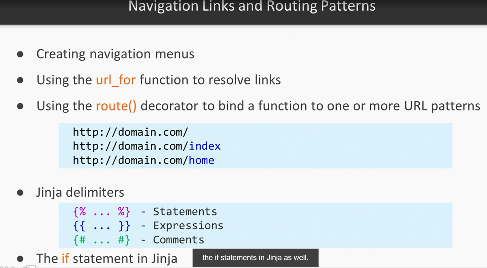

TO create a new Virtaul environment, run the code ```py -m venv <name-of-venv>```

To activate the virtaul env, run the command ```<path-to->\Scripts\activate```

To exit the virtual env, run the command ```deactivate```

Run ```pip install flast-wtf``` package to enable the use of Forms

Run ```pip install python-dotenv``` package to enable the use and reading of the .flaskenv file


To create the requirements folder (similar to package.json in NodeJs), use the command ```pip freeze > requirements.txt```

And to install from the requirements file, use the command ```pip install -r requirements.txt```

To run the flask application, use the command ```flask run```

<i>```__init__```</i> files are synonymous to initialization files. Like an index file, they are the entry points to the directory and also is used to initialize all that needs to be initialized for that package (i.e. directory)

It's always a good idea to configure your sever as a seperate file( in this case config.py), so you can access all the configurations through the Class.

It's also a good idea to define your routes, seperate from your application logic. In this case, we would create a ```routes.py``` file in the app folder to handle our routes.

<strong>Some syntax to note for using Jinja templating engine:</strong><br/>



